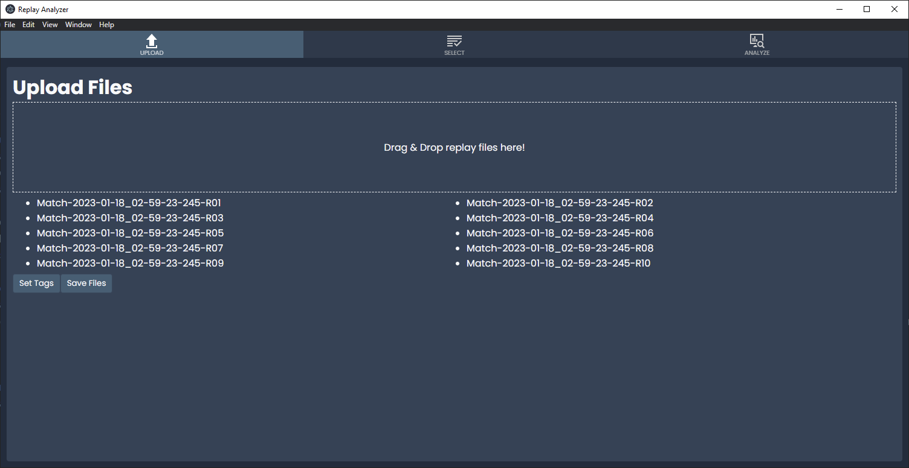
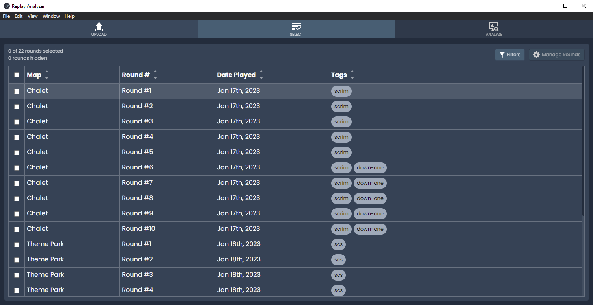
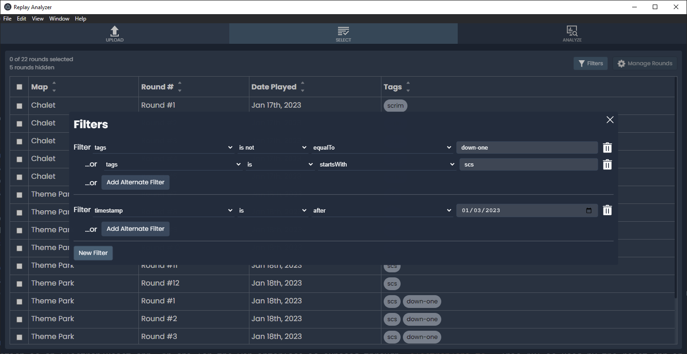
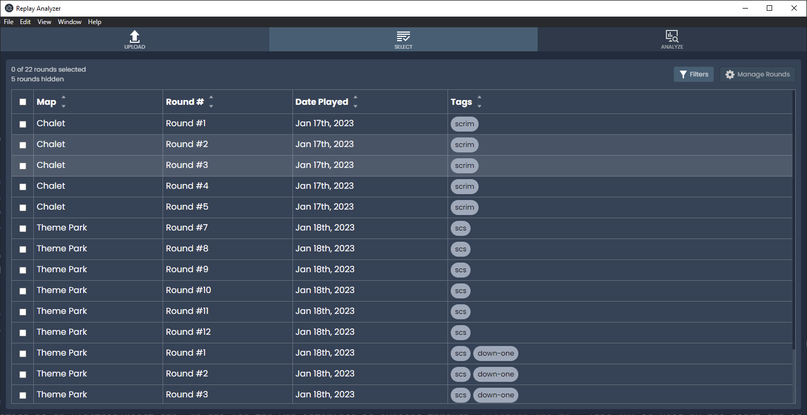
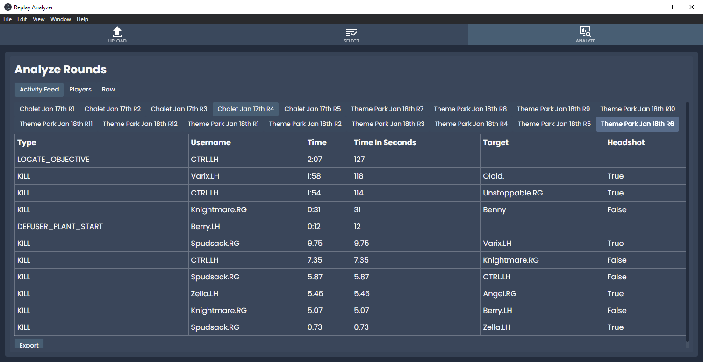
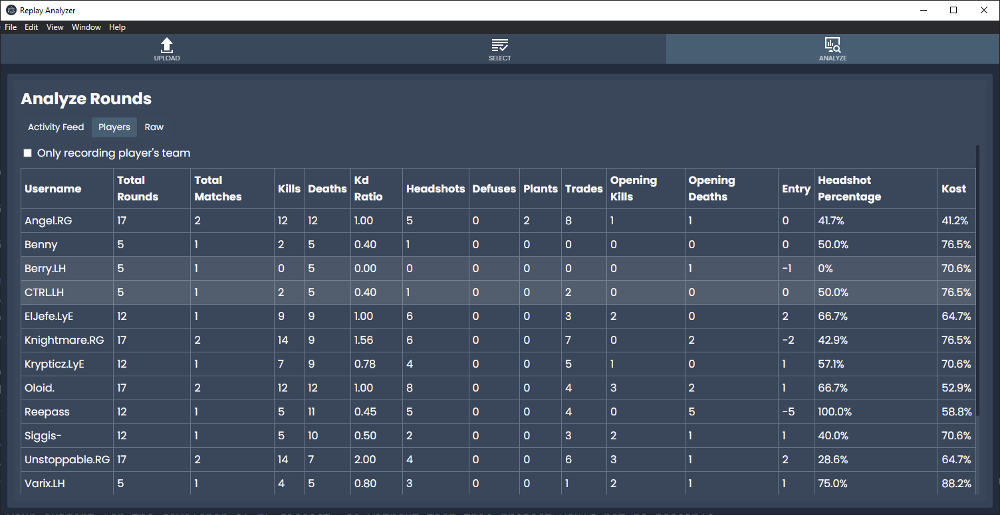
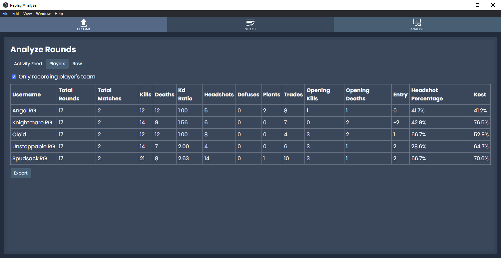
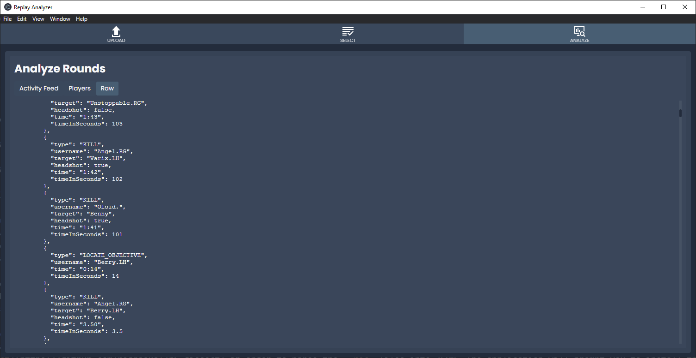

# Replay Analyzer
A tool which can be used to do basic data analysis on R6 replay files.

## Latest version
V0.4.0

## What can it do?
### Upload & Save your replay files for later use

### Manage & Tag your rounds

### Filter your rounds down for more relevant analysis

### Look at & export the events that happened for any of the selected rounds

### Look at & export the player states aggregated across all selected rounds

### Or even look at the raw data to calculate your own stats

## Future Support
This application is currently being developed as a side-project for
Revival Games GG's Rainbow Six: Siege Team. I am in no way affiliated
with the team. I'm doing this as a favor to some old team mates.

If you would like to see additional features, please file issues
on this GitHub page. Without guidance from the issues page, 
only updates requested by RG will be added to this application.

## Dependencies  
This application depends on:
- [r6-dissect](https://github.com/redraskal/r6-dissect) in order to parse the `.rec` files into JSON. The application will prompt you to install this application before allowing you to continue.

Please show your support for the developer of r6-dissect, as without them this project would not be possible.

# Development
This application is an Electron/React app. An api for the web interface is exposed through `electron/api.ts`. This API is used by the react app in `/src` to interface directly with
r6-dissect, and the file system.
